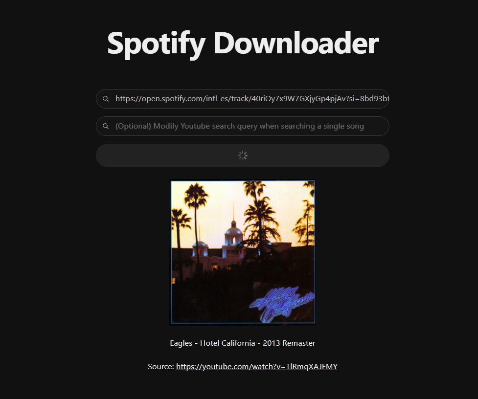

# 🎵 SpotifyDownloader

A powerful web application that allows you to download entire playlists or single songs from Spotify by simply providing their links. The app automatically searches for the best match on YouTube and downloads it with the correct metadata.



## 🌟 Features

-   📥 **Playlist Download**: Download entire Spotify playlists at once
-   🎵 **Single Track Download**: Download individual songs from Spotify
-   🔍 **Smart Search**: Automatic YouTube matching for best audio quality
-   ✏️ **Custom Search**: Override the YouTube search query if needed
-   📝 **Metadata**: Preserves original Spotify track metadata

## 🔧 Prerequisites

-   Node.js 18.0 or higher
-   npm or yarn
-   Spotify Developer Account
-   A Spotify API Key and Client Secret

## 🚀 Technologies

-   **Frontend:**

    -   React
    -   Radix UI
    -   JavaScript
    -   HTML/CSS

-   **Backend:**
    -   Node.js
    -   Express
    -   Spotify Web API

## 💻 Installation

1. Clone the repository:

```bash
git clone https://github.com/your-username/SpotifyDownloader.git
cd SpotifyDownloader
```

2. Install dependencies:

```bash
npm install
```

3. Create a `.env.development` file with your Spotify credentials, you must copy the file `.env.example` and fill in these parameters:

```bash
SPOTIFY_CLIENT_ID=your_client_id
SPOTIFY_CLIENT_SECRET=your_client_secret
```

4. Start the backend server:

```bash
npm run server
```

5. Start the development server:

```bash
npm run dev
```

## 🔑 Getting Spotify API Credentials

1. Go to [Spotify Developer Dashboard](https://developer.spotify.com/dashboard)
2. Log in with your Spotify account
3. Click "Create an App"
4. Fill in the application name (e.g., "SpotifyDownloader") and description
5. Once created, you'll see your Client ID
6. Click "Show Client Secret" to reveal your Client Secret
7. Copy both values to your `.env.development` file

## ⚠️ Important Notes

-   This tool is for personal use only
-   Respect copyright and terms of service of both Spotify and YouTube
-   The download feature uses YouTube as a source for audio files
